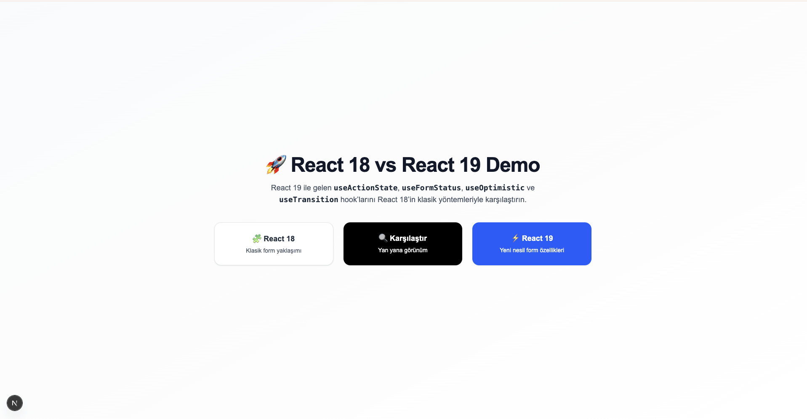
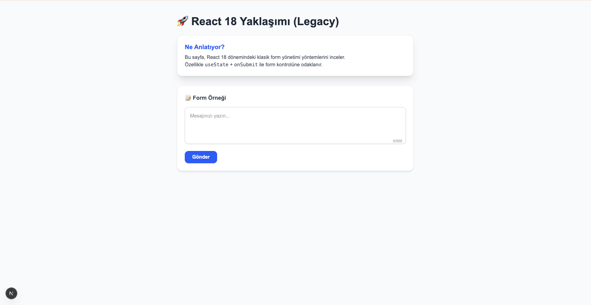
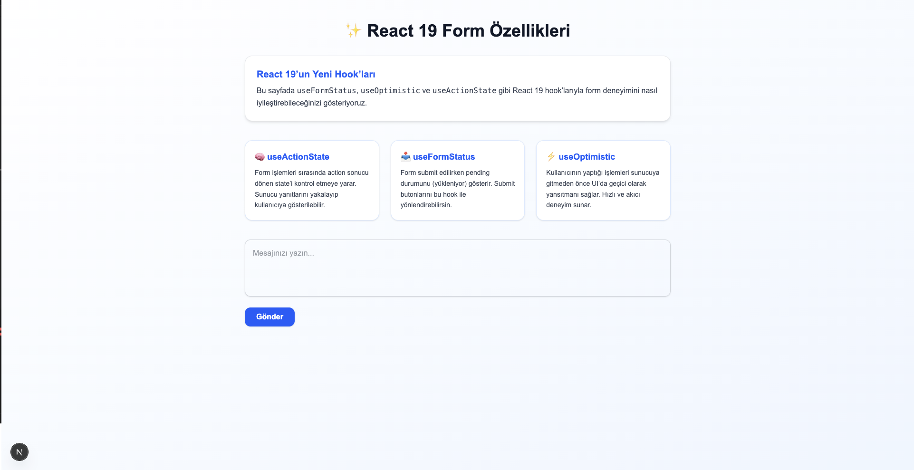
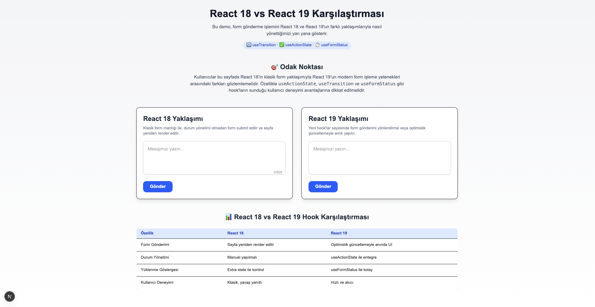

# React 18 vs React 19 — Form Handling Comparison

A beautifully designed, side-by-side demo showcasing the evolution of form handling between **React 18** and **React 19**, with a focus on new hooks such as `useActionState`, `useFormStatus`, and `useOptimistic`.

---

## 📈 Overview

This project demonstrates how React 19's experimental form APIs simplify code and improve user experience compared to the traditional methods used in React 18.

You can explore:

* **Legacy Approach**: Classic form submission via state and page refresh (`/legacy`)
* **Modern Approach**: Optimistic UI updates and hook-based state management (`/modern`)
* **Comparison Mode**: React 18 and React 19 rendered side-by-side for visual and behavioral comparison (`/compare`)

---

## 🌟 Key Features

* **Fully Responsive UI** with Tailwind CSS
* **Animated transitions & modern design**
* **Explanation boxes** for each React 19 hook
* **Comparison table** showing usage and behavior differences
* **Demo Feedback Forms** for live experimentation

---

## 📚 Technologies Used

* **Next.js 14 (App Router)**
* **React 19 (Experimental)**
* **Tailwind CSS**
* **New React APIs**:

  * `useActionState`
  * `useFormStatus`
  * `useOptimistic`
  * `useTransition`

---

## 🚀 Getting Started

```bash
# 1. Clone the repo
$ git clone https://github.com/bkaratas/react19vs18

# 2. Install dependencies
$ npm install

# 3. Run locally
$ npm run dev

# Open on http://localhost:3000
```

---

## 🌐 Demo Pages

| Page       | Description                                         |
| ---------- | --------------------------------------------------- |
| `/`        | Home page with navigation to all demos              |
| `/legacy`  | React 18 classic form demo                          |
| `/modern`  | React 19 modern form with new hooks                 |
| `/compare` | Visual and behavioral comparison of both approaches |

---

## 💡 Screenshots

### Home Page




### Legacy Form (React 18)



### Modern Form (React 19)



### Comparison Page



---

## 🙌 Why This Project?

React 19 introduces new primitives for form control that reduce boilerplate and improve UX. This project demonstrates these differences not only in code but in actual behavior, which can be useful for:

* Teaching React 19's new features
* Comparing ergonomics
* Building real-world, modern UI demos
* Showcasing transitions on LinkedIn or your portfolio

---

## 📢 Contributions

Contributions, feedback, and forks are welcome! Feel free to open an issue or PR.

---

## 🙏 Acknowledgements

Thanks to the React team for pushing the boundaries of DX and to the community for continuously sharing knowledge!


